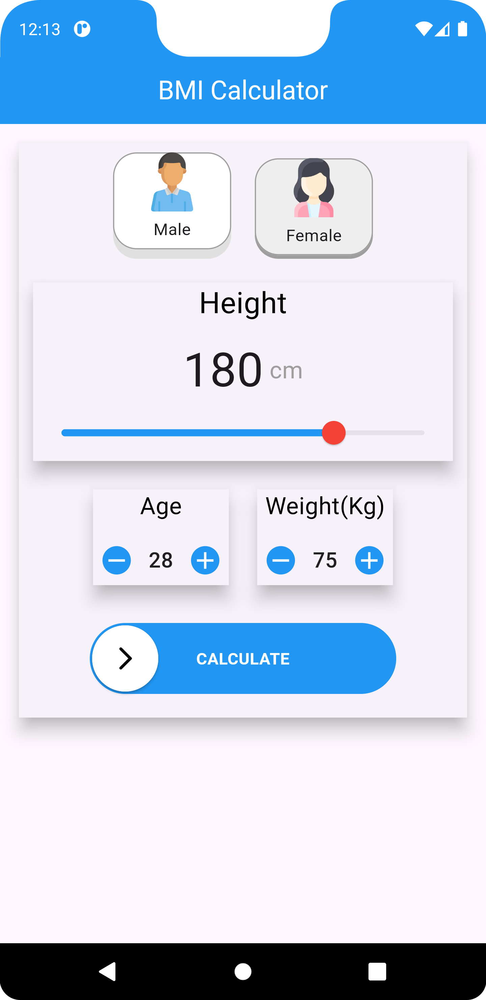

# BMICalculator

## Project overview

BMICalculator is a simple and intuitive mobile app designed to help users calculate their Body Mass Index (BMI) based on their height, weight, gender, and age. The app provides personalized feedback on the user's BMI status and offers recommendations for maintaining or improving their health.

## Features

- **BMI Calculation:** Easily calculate your BMI using weight and height.
- **Gender and Age Consideration:** Inputs for gender and age for a more personalized experience.
- **BMI Categories:**:  Underweight, Normal, Overweight and Obese
- **Health Recommendations:** Receive advice based on your BMI status.
- **User-Friendly Interface:** Simple and clean UI for easy navigation.

## Usage

1. **Enter Your Details:** 
   - Select your gender.
   - Enter your age.
   - Input your height (in meters).
   - Input your weight (in kilograms).
2. **Calculate:** Press the "Calculate BMI" button.
3. **View Results:** The app will display your BMI, categorize it as Underweight, Normal, Overweight, or Obese, and provide a recommendation for your health.

## Screenshots

### Home Page

### Score Page 

| Underweight | Normal | Overweight | Obese |
|--------------|---------------|------------|-------|
|  |  |  |  |

### Share Option

